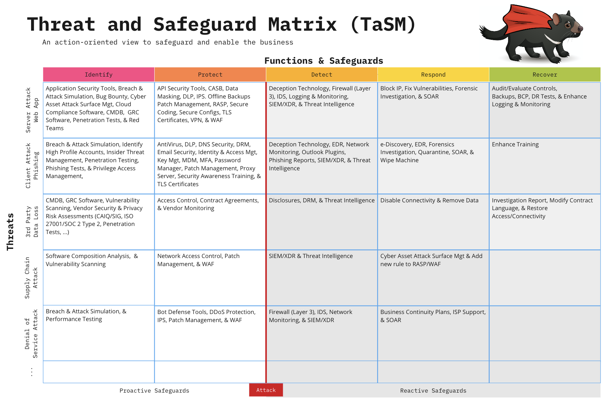
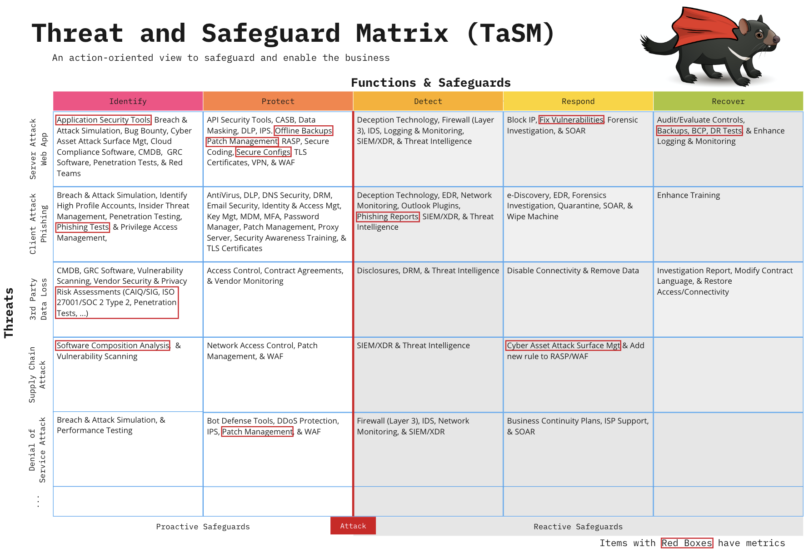
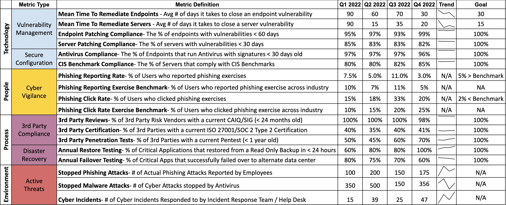
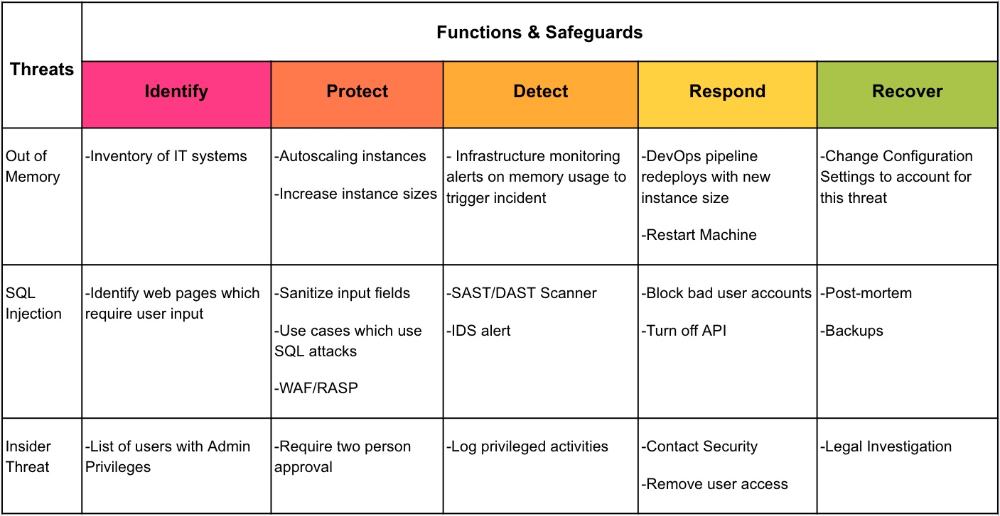
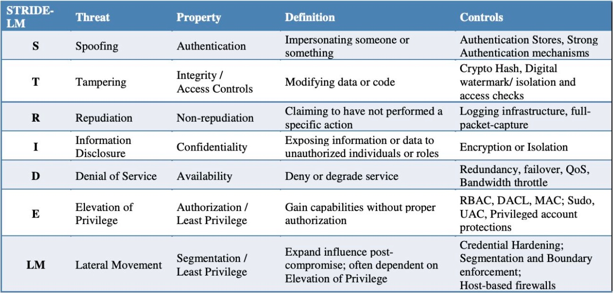
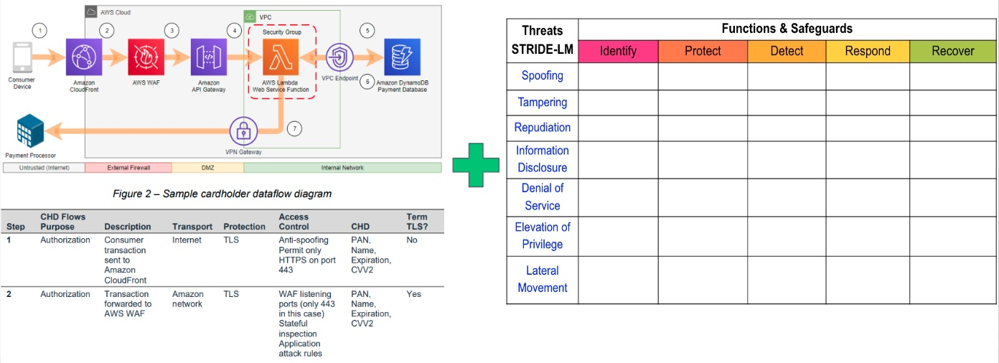
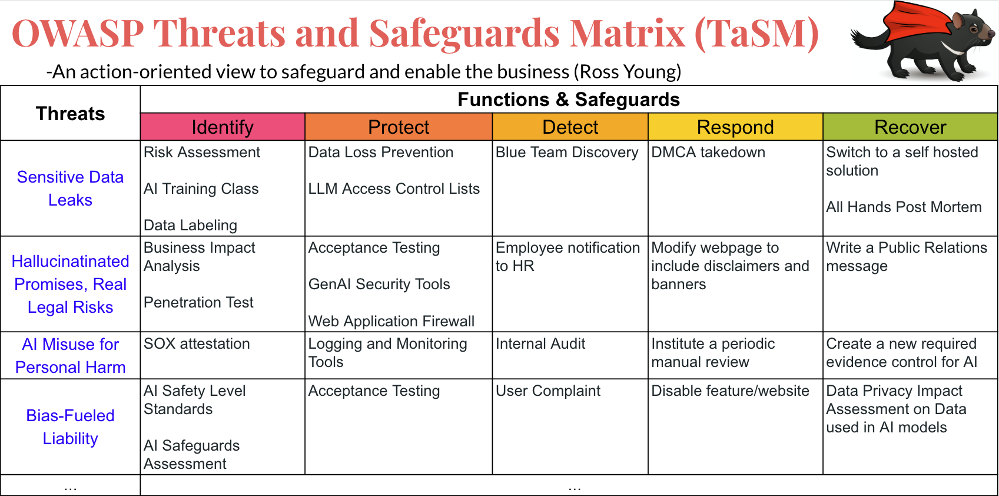

---

layout: col-sidebar
title: OWASP Threat and Safeguard Matrix (TaSM)
tags: TaSM
level: 2
type: documentation

---
This work is licensed under a <a rel="license" href="http://creativecommons.org/licenses/by-sa/4.0/">Creative Commons Attribution-ShareAlike 4.0 International License</a>.

# Introduction
The Threat and Safeguard Matrix (TaSM) is an action-oriented view to safeguard and enable the business created by [CISO Tradecraft](https://www.cisotradecraft.com/).  Simply put if Cyber is in the Business of Revenue Protection, then we need to have a defense in depth plan to combat the biggest threats to our companies.  This matrix allows a company to overlay its major threats with the NIST Cyber Security Framework Functions (Identify, Protect, Detect, Respond, & Recover) to build a robust security plan.  Organizations that perform this activity will gain a better understanding of how to protect their company as they fill in safeguards that mitigate important threats.  Remember the devil is in the details, hence why we chose a TaSManian Devil as the project logo.

Example: If you were to look across the information security industry, then you would notice that the largest threats to companies often involve things like the following: Web Application Attacks, Phishing, 3rd Party Data Loss, Supply Chain Attacks, or Denial of Service. Please note you can add others to the matrix like Insider Threats, User Errors, Fraud, or anything unique to your environment.

Here's one way you might build a defense in depth plan to mitigate these threats for your company.

# Common Examples of Threats
If you are looking for common examples of threats which can cause material loss consider using any of the following scenarios:
1. **Brand Impersonation Scams** – Imposters launch fake websites to sell counterfeit products under your name.
2. **Business Email Compromise** – Employees fall for a phishing scam, handing over usernames, passwords, and even MFA codes.
3. **Business Logic Bugs** – A bug in your trading algorithm generates losses instead of profits.
4. **BYOD Issues** – Remote employees outsource their work, unknowingly involving unauthorized foreign actors from North Korea.
5. **CEO Impersonation** – A fraudster impersonates your CEO with deep fakes on social media, spreading rumors of layoffs and financial troubles tanking your stock price.  Note your CEO doesn't even have social media
6. **Cloud Disruption** – Your cloud provider or SaaS partner goes down, and so does your business continuity.
7. **Compliance Attestation Complications** – Misinterpreting regulations leads to false attestations—and potential legal action.
8. **Credential Theft Issues** – Your open-source project accidentally exposes secret tokens and private keys to sensitive servers and cloud environments.
9. **Customer Rewards Raid** – Digital thieves snatch customer reward points, leaving your support team flooded with angry calls.
10. **Email Overloaded** – Your leadership drowns in endless spam from throwaway Gmail accounts.
11. **Deepfake Deception** – A hyper-realistic deepfake of your CFO tricks the accounts payable team into wiring unauthorized funds.
12. **DDoS/Botnet Attack** – A swarm of bots takes down your website after a controversial corporate statement.
13. **Forum Defacement** – Script kiddies flood your customer help forums with junk, wrecking your brand’s credibility.
14. **Help Desk Hijack** – Impersonators sweet-talk IT support into resetting employee passwords.
15. **Insider Threat** – Departing researchers take sensitive IP to a rival company.
16. **Infected IoT Devices** – Malware takes over your unpatchable IoT devices, turning them into cyber-zombies.
17. **Open Source Trojan** – That “helpful” library your developers installed? It came preloaded with malware and crypto miners.
18. **Prolonged Power Outages** – Natural disasters knock out power, and your operations grind to a halt.
19. **Hardware Exploits** – Nation-state attackers slip implants into your networking gear.
20. **Payment Fraud** – Scammers trick your customers into redirecting payments to their fraudulent accounts.
21. **Private Data is Publicly Exposed** – Sensitive data leaks from a misconfigured public S3 bucket.  Now your secrets are out.
22. **Rogue Access Points** – Rogue networks near your company cafeteria mimic your corporate Wi-Fi to lure in unsuspecting employees.
23. **Wrong Access Permissions** – Sensitive SharePoint data ends up in the hands of the wrong reseller—for years.
24. **Unpatched Laptops** – An employee connects to airport Wi-Fi and unknowingly invites malware onto an unpatched laptop.
25. **Zero-Day Attack** – Hackers exploit a fresh OpenSSL/Log4J vulnerability on your public website before a patch even exists.

* If you are looking for detailed list of threat events from NIST, then consider using [NIST Special Publications 800-30 Appendix E-1](https://nvlpubs.nist.gov/nistpubs/Legacy/SP/nistspecialpublication800-30r1.pdf)

# Adding Metrics to the Plan
Now that you have built your TaSM, it's important to look at the safeguards you listed and where you have gaps.  Not every safeguard will be as important.  If everything is important, then nothing is truly important.  Think about the safeguards you want to focus on as an organization.  These may be the ones that are the most effective in stopping the threat.  These safeguards may also be where you have the largest opportunity to improve.  Pick a few safeguards that you can place key metrics on and highlight them by adding a red box.  This will allow you to map progress from your metrics to your TaSM.  Remember, what gets measured gets done and what gets done gets funded.

# Creating a Cyber Report Card
After outlining the safeguards your organization wants to make improvements on, you should create metrics that matter and place them on a scorecard.  This example has a few things to notice, but feel free to make modifications. Group things into key categories such as Technology, People, Processes, and the Environment.  Note Environment refers to things outside of your organization's control (i.e. Bad actors or external regulators) 

The scorecard is broken down into metrics that can be monitored, measured, and analyzed.  You can think of them as Key Performance Indicators (KPIs) to measure the success of information security activities being performed within an organization.  Remember a good metric displays 4-5 important things:
1. A clear <b>Definition</b> of what the metric means
2. The <b>Status</b> of where the metric is right now as well as during previous points in time
3. A <b>Trend Line</b> to easily highlight if the current status has improved, stayed consistent, or gotten worse
4. A <b>Goal</b> to show a clear definition of done or desired state for the organization to achieve
5. (Optional) The <b>Due Date</b> on when you expect your goal to be achieved in the future.  Note this is optional since you may have metrics that have already hit the goal and just need to maintain compliance going forward.

Finally, use your scorecard to tell a story that can be shared with executive leadership teams.  Please note this story is fictitious and does not reflect an actual company.

<b>Example:</b> This scorecard identifies the risk profile of XYZ organization.  As you can see, we show that 99% of our servers are patching critical vulnerabilities in 20 days.  While these vulnerability numbers are higher than our desired goal of 15 days, we also install tools such as Web Application Firewalls, Proxy Servers, and Antivirus.  These safeguards provide additional protection during gap windows when we can't patch fast enough.  We feel comfortable in our patching program currently but know that this is one of our most volatile metrics.  One area we would like to highlight is only 60% of our software teams were successful during the annual failover exercise.  This means that 40% of our SOX applications would not be available if our primary data center were to experience a major disaster such as loss of power during a hurricane.  We will be taking XYZ actions to help improve this metric.  As you may recall we are hyper-focused on ransomware defenses.  That's why we are very happy to show that we have now achieved successful restoration testing on 100% of critical applications.  This means that if a ransomware actor were able to encrypt our servers, we feel confident in our ability to recover without having to pay the ransom.  We will now be focusing on XYZ to ...

# Using the TaSM to enhance Threat Modeling
As we look for additional ways to apply the TaSM in an organization, one way the TaSM might be leveraged is within Application Threat Modeling Discussions.  A Threat Model shown by an application team might look like the following:

Application Development teams might standardize threat categories by using proven threat models such as STRIDE-LM model to identify common threats to applications.

Application teams can also combine a STIDE-LM enhanced TaSM with a [data flow diagram](https://d1.awsstatic.com/whitepapers/compliance/pci-dss-compliance-on-aws.pdf?did=wp_card&trk=wp_card).  Note a data flow diagram is a network diagram that shows key attributes such as (Encryption Layers, Access Control Methods, and Data Types).

By using both a STRIDE-LM enhanced TaSM and a Data Flow Diagram application teams can have a simple and effective way to describe their applications and thier perceived threats during architecture review boards.  This can create insightful discussions.  Additionally, architecture review boards might notice that 20% of all applications possess the same findings.  These findings can be communicated to IT leadership for resolution by an enterprise solution.
 

# Using the TaSM to help improve Risk Committees
Since cyber threats are not the only types of threats, we should also look at how the TaSM could be adopted for larger use in Risk Committees.  All that is needed is an additional column to list the organization within a company.  Imagine if each organization shared its top 3-5 threats.  Your Risk Committee could show how the company is mitigating its biggest threats in a <b>Consistent, Adequate, Reasonable, and Effective (CARE)</b> way.  Additionally, it allows the committee to partner together to solve threats from multiple angles.  Example: How might Cyber leverage HR and Legal processes to help respond to Phishing attacks that cause brand damage?

# Using the TaSM to Safeguard against AI Related Threats
Don't forget to use the TaSM against emerging threats such as Artificial Intelligence (AI).  It's a great way to show what an effective strategy might look like for cutting edge threats.  This is extremely helpful when you might need to forecast the breadth of solutions needed to create an effecitve program to stop emerging threats in AI.  

For example: Let's say there are 7 material threats that your company is worried about regarding the use of Generative AI and Large Language Models (LLMs):
1. **Sensitive Data Leaks**: Employees upload sensitive information or intellectual property to unauthorized external LLMs.
2. **Malicious AI Supply Chains**: A developer integrates an AI/ML model contaminated with malware or hidden cryptocurrency miners.
3. **Hallucinated Promises, Real Legal Risks**: Your chatbot falsely commits to outcomes your company cannot deliver, leading to legal exposure.
4. **Data Overexposure**: Training your LLM on unrestricted company research enables insiders to bypass Role-Based Access Controls and access sensitive data.
5. **AI Misuse for Personal Harm**: An employee exploits your LLM’s capabilities to stalk or harass an ex-spouse.
6. **Unethical AI Recommendations**: Your language model makes morally questionable decisions, like suggesting euthanasia to reduce financial strain.
7. **Bias-Fueled Liability**: Loan-issuing AI trained on data fields like sex, race, and age creates legal and reputational risks.

Consider creating the TaSM to showcase how you'd safeguard your organization from the top 4 out of 7 AI threats most relevant to your business. For instance:

This matrix makes it clear that there is no single solution that your company can buy to solve AI security. Each threat demands a unique set of safeguards, highlighting the necessity of a robust, defense-in-depth strategy to effectively counter a diverse range of AI risks and protect your company from material impacts.

# What do the terms mean?
To ensure proper use of the TaSM, be sure to understand the definitions of the terms used within the matrix

### Cyber Security
Cyber security is the Business of Revenue Protection.  Cyber security is all about understanding, managing, and mitigating the risk of your critical data being disclosed (confidentiality), altered (integrity), or denied (availability).  

### Threats
The Committee on National Security Systems (CNSS) defines a **[Threat](https://csrc.nist.gov/glossary/term/threat)** as any event with the potential to adversely impact organizational operations.

### NIST Functions
The 5 NIST Cyber Security Framework Functions allow you to create a defense in-depth strategy that identifies how you will safeguard the business.  

**1) Identify**
The identify function assists in developing an organizational understanding of managing risk to systems, people, assets, data, and capabilities.  Key Objective: Identify all people, processes, or systems that would be vulnerable to this type of threat.  

**2) Protect**
The protect function supports the ability to limit or contain the impact of the threat. Key Objective: How could you limit the threat of an attack by removing or blocking the vulnerability

**3) Detect**
The detect function defines the activities to identify the occurrence of an event in a timely manner.  Key Objective: If you couldn't stop the threat (i.e. protect phase) how would you know it's even happening, and your company is experiencing harm

**4) Respond**
The respond function includes appropriate activities regarding an incident to minimize impact.  Key Objective: If the threat has been realized how do you prevent additional financial damage, reputation damage, non-compliance, or privacy violations 

**5) Recover**
The recover function includes identifying appropriate activities to maintain plans for resilience and to restore services impaired during cyber security incidents.  Key Objective: How do you get to a state that was equal or better than before the incident

### Safeguards
**Safeguards** are Actions, devices, procedures, techniques, or other measures that reduce the vulnerability of an information system. Synonymous with security controls and Countermeasures.  Feel free to use these lists as a starting point:
#### [153 CIS Controls V8 Implementation Group](https://learn.cisecurity.org/CIS_Controls_v8_Implementation_Groups_Handout)
#### [108 Safeguards outlined by NIST CSF](https://github.com/OWASP/www-project-threat-and-safeguard-matrix/blob/main/Nist_CSF_Safeguards) 
#### [42 Mitre Enterprise Mitigations](https://attack.mitre.org/mitigations/enterprise/)
#### [ISO 27002:2022 Information Security Controls](https://www.iso.org/standard/75652.html)

One common way to organize safeguards is by catergorizing each of them into one of three buckets

**People** - People safeguards can be thought of as education, training, and awareness activities that influence human behaviors

**Process** - Process safeguards can be thought of as Policies, Practices, & Proof or Evidence to operationalize desired outcomes.

**Technology** - Technological safeguards can be thought of as any technical solution that improves the safety and security of a system (WAF, Firewall, Antivirus, etc.)

# Thank You
Thanks to the many folks who helped inspire and Improve the Threat and Safeguard Matrix
#### [Cyber Defense Matrix](https://cyberdefensematrix.com/) by [Sounil Yu](https://www.linkedin.com/in/sounil/)
#### [Eric Bragger](https://www.linkedin.com/in/eric-bragger/)
#### [Andy Ellis](https://www.linkedin.com/in/csoandy/)

<!DOCTYPE html>
<html lang="en">
<head>
    <meta charset="UTF-8">
    <meta name="viewport" content="width=device-width, initial-scale=1.0">
    <title>OWASP Threat and Safeguard Matrix (TaSM) Builder</title>
    

    
</head>
<body>

<header>
    

        <h1>OWASP Threat & Safeguard Matrix</h1>
        
The Threat and Safeguard Matrix (TaSM) is an action-oriented view to safeguard and enable the business created by CISO Tradecraft. Simply put if Cyber is in the Business of Revenue Protection, then we need to have a defense in depth plan to combat the biggest threats to our companies. This matrix allows a company to overlay its major threats with the NIST Cyber Security Framework Functions (Identify, Protect, Detect, Respond, & Recover) to build a robust security plan. Organizations that perform this activity will gain a better understanding of how to protect their company as they fill in safeguards that mitigate important threats.

    

    
    
</header>

    

        

            <strong>How to use:</strong> 
            1. Add a Threat from the list below or create your own. 
            2. Fill in the specific safeguards for each NIST function. 
            3. Double-click any cell to toggle the Red Box (Metrics) to indicate a key performance indicator or focus area.
        

        
        <button class="btn-save-img" onclick="saveAsImage()" title="Click to take a screenshot of the matrix">
            <svg xmlns="http://www.w3.org/2000/svg" viewBox="0 0 24 24" fill="none" stroke="currentColor" stroke-linecap="round" stroke-linejoin="round">
                <path d="M23 19a2 2 0 0 1-2 2H3a2 2 0 0 1-2-2V8a2 2 0 0 1 2-2h4l2-3h6l2 3h4a2 2 0 0 1 2 2z"/>
                <circle cx="12" cy="13" r="4"/>
            </svg>
            Save a Picture
        </button>

    

    

        <table id="tasmTable">
            <thead>
                <tr>
                    <th class="th-threat">Threat Scenario</th>
                    <th class="th-identify">IdentifyFind Vulnerabilities</th>
                    <th class="th-protect">ProtectBlock Attacks</th>
                    <th class="th-detect">DetectMonitor Threats</th>
                    <th class="th-respond">RespondContain Damage</th>
                    <th class="th-recover">RecoverRestore Systems</th>
                </tr>
            </thead>
            <tbody id="matrixBody">
                </tbody>
        </table>
    

    

        <button class="btn-add" onclick="addEmptyRow()">+ Add New Threat Row</button>
    

    

        <h3>Common Threat Library (Click to Add)</h3>
        
Select a threat to add it to your matrix immediately. (Hover over tag to see description)

        

            
Brand Impersonation Scams

            
Business Email Compromise

            
Business Logic Bugs

            
BYOD Issues

            
CEO Impersonation

            
Cloud Disruption

            
Compliance Attestation Complications

            
Credential Theft Issues

            
Customer Rewards Raid

            
Email Overloaded

            
Deepfake Deception

            
DDoS/Botnet Attack

            
Forum Defacement

            
Help Desk Hijack

            
Insider Threat

            
Infected IoT Devices

            
Open Source Trojan

            
Prolonged Power Outages

            
Hardware Exploits

            
Payment Fraud

            
Private Data Publicly Exposed

            
Rogue Access Points

            
Wrong Access Permissions

            
Unpatched Laptops

            
Zero-Day Attack

        

    

<footer>
    &copy; 2025 Erudite Candor Publishing. All Rights Reserved.
</footer>

</body>
</html>
