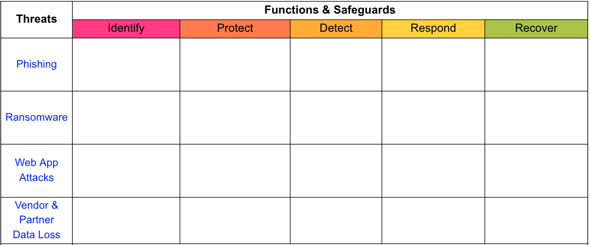

---
# Introduction
The Threat and Safeguard Matrix or (TaSM) is an action oriented view to safeguard and enable the business created by [Ross Young](https://www.linkedin.com/in/mrrossyoung/).  Simply put if Cyber is in the business of Revenue Protection, then we need to have a defense in depth plan to combat the biggest threats to our companies.  This matrix allows a company to overlay its major threats with the NIST CSF functions (Identify, Protect, Detect, Respond, & Recover) to build a security plan.  Organizations who perfrom this activitiy will gain a better understanding of how to protect their company as they fill in safeguards that mitigate each threat.  

Example if you were to look across the information security industry you would notice that the largest data breaches against companies often involve Phishing, Ransomware, Web Application Attacks, and Vendor/Partner Data Loss. Here's one way you might mitigate these for your company.

# How does it work?

### Threats
CNSS defines a **Threat** as any event with the potential to adversely impact organizational operations.
Common Examples of Common Threat types can be found here [STRIDE-LM](assets/images/StrideLM.png "STRIDE-LM")

### Functions & Safeguards

The 5 NIST Cyber Security Framework Functions
#### Identify 
The identify function assists in developing an organizational understanding of managing risk to systems, people, assets, data, and capabilities.  Key Objective: Identify all people, proccesses, or systems that would be vulnerable to this type of threat.  
#### Protect
The protect function supports the ability to limit or contain the impact of the threat. Key Objective: How could you limit the threat of a an attack by removing or blocking the vulnerability
#### Detect
The detect function defines the activities to identify the occurence of an event in a timely mannner.  Key Objective: If you couldn't stop the threat (ie protect phase) how would you know it's even happening and your company is experiencing harm
#### Respond
The respond function includes appropriate activities regarding an incident to minimize impact.  Key Objective: If the threat has been realized how do you prevent additional financial damage, reputation damage, non compliance, or privacy violations 
#### Recover
The recover function includes identifying appropriate activities to maintain plans for resilience and to restore services impaired during cybersuecrity incidents.  Key Objective: How do you get to a state that was equal or better than before the incident

### Safeguards
**Safeguards** are Actions, devices, procedures, techniques, or other measures that reduce the vulnerability of an information system. Synonymous with security controls and Countermeasures.  Please note you can see the [108 different safeguards outlined by NIST CSF](https://github.com/OWASP/www-project-threat-and-safeguard-matrix/blob/main/Nist_CSF_Safeguards) however don't feel forced to use them as shown by the Example TaSM below.
