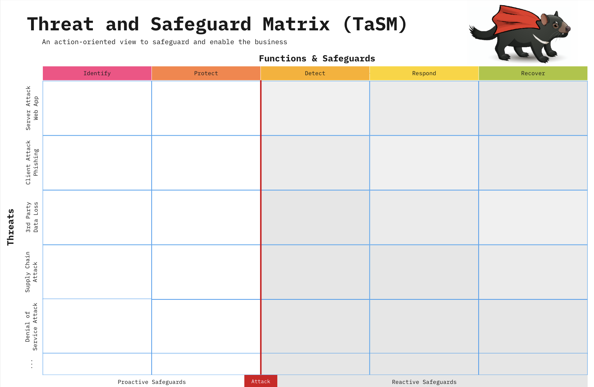

---

layout: col-sidebar
title: OWASP Threat and Safeguard Matrix (TaSM)
tags: TaSM
level: 2
type: documentation

---
This work is licensed under a <a rel="license" href="http://creativecommons.org/licenses/by-sa/4.0/">Creative Commons Attribution-ShareAlike 4.0 International License</a>.

# Introduction
The Threat and Safeguard Matrix (TaSM) is an action-oriented view to safeguard and enable the business created by [CISO Tradecraft](https://www.cisotradecraft.com/).  Simply put if Cyber is in the Business of Revenue Protection, then we need to have a defense in-depth plan to combat the biggest threats to our companies.  This matrix allows a company to overlay its major threats with the NIST Cyber Security Framework Functions (Identify, Protect, Detect, Respond, & Recover) to build a robust security plan.  Organizations that perform this activity will gain a better understanding of how to protect their company as they fill in safeguards that mitigate important threats.  Remember the devil is in the details, hence why we chose a TaSManian Devil as the project logo.

Example: If you were to look across the information security industry, then you would notice that the largest threats to companies often involve things like the following: Web Application Attacks, Phishing, 3rd Party Data Loss, Supply Chain Attacks, or Denial of Service. Please note you can add others to the matrix like Insider Threats, User Errors, or anything unique to your environment.

Here's one way you might build a defense-in-depth plan to mitigate these threats for your company.

# Adding Metrics to the Plan
Now that you have built your TaSM, it's important to look at the safeguards you listed.  Not every safeguard will be as important.  If everything is important, then nothing is truly important.  Think about the safeguards you want to focus on as an organization.  These may be the ones that are the most effective in stopping the threat.  These safeguards may also be where you have the largest opportunity to improve.  Pick a few safeguards that you can place key metrics on and highlight them by adding a red box.  This will allow you to map progress from your metrics to your TaSM.  Remember, what gets measured gets done and what gets done gets funded.

# Creating a Cyber Report Card
After outlining the safeguards your organization wants to make improvements on, you should create metrics that matter and place them on a scorecard.  This example has a few things to notice, but feel free to make modifications. Group things into key categories such as Technology, People, Processes, and the Environment.  Note Environment refers to things outside of your organization's control (i.e. Bad actors or external regulators) 

The scorecard is broken down into metrics that can be monitored, measured, and analyzed.  You can think of them as Key Performance Indicators (KPIs) to measure the success of information security activities being performed within an organization.  Remember a good metric displays 4-5 important things:
1. A clear <b>Definition</b> of what the metric means
2. The <b>Status</b> of where the metric is right now as well as during previous points in time
3. A <b>Trend Line</b> to easily highlight if the current status has improved, stayed consistent, or gotten worse
4. A <b>Goal</b> to show a clear definition of done or desired state for the organization to achieve
5. (Optional) The <b>Due Date</b> on when you expect your goal to be achieved in the future.  Note this is optional since you may have metrics that have already hit the goal and just need to maintain compliance going forward.

Finally use your scorecard to tell a story that can be shared with executive leadership teams.  Please note this story is fictitious and does not reflect an actual company.

<b>Example:</b> This scorecard identifies the risk profile of XYZ organization.  As you can see, we show that 99% of our servers are patching critical vulnerabilities in 20 days.  While these vulnerability numbers are higher than our desired goal of 15 days, we also install tools such as Web Application Firewalls, Proxy Servers, and Antivirus.  These safeguards provide additional protection during gap windows when we can't patch fast enough.  We feel comfortable in our patching program currently but know that this is one of our most volatile metrics.  One area we would like to highlight is only 60% of our software teams were successful during the annual failover exercise.  This means that 40% of our SOX applications would not be available if our primary data center were to experience a major disaster such as loss of power during a hurricane.  We will be taking XYZ actions to help improve this metric.  As you may recall we are hyper-focused on ransomware defenses.  That's why we are very happy to show that we have now achieved successful restoration testing on 100% of critical applications.  This means that if a ransomware actor were able to encrypt our servers, we feel confident in our ability to recover without having to pay the ransom.  We will now be focusing on XYZ to ...

# Using the TaSM to enhance Threat Modeling
As we look for additional ways to apply the TaSM in an organization, one way the TaSM might be leveraged is within Application Threat Modeling Discussions.  A Threat Model shown by an application team might look like the following:

Application Development teams might standardize threat categories by using proven threat models such as STRIDE-LM model to identify common threats to applications.

Application teams can also combine a STIDE-LM enhanced TaSM with a [data flow diagram](https://d1.awsstatic.com/whitepapers/compliance/pci-dss-compliance-on-aws.pdf?did=wp_card&trk=wp_card).  Note a data flow diagram is a network diagram which shows key attributes such as (Encryption Layers, Access Control Methods, and Data Types).

By using both a STRIDE-LM enhanced TaSM and a Data Flow Diagram application teams can have a simple and effective way to describe their applications and its perceived threats during Architecture Review Boards.  This can really create insightful discussions.  Additionally Architecture Review Boards might notice that 20% of all applications possess the same findings.  These findings can be communicated to IT leadership for resolution with an enterprise solution.
 

# Using the TaSM to help improve Risk Committees
Since cyber threats are not the only types of threats, we should also look at how the TaSM could be adopted for larger use in Risk Committees.  All that is needed is an additional column to list the organization within a company.  Imagine if each organization shared their top 3-5 threats.  Your Risk Committee could show how the company is mitigating its biggest threats in a <b>Consistent, Adequate, Reasonable, and Effective (CARE)</b> way.  Additionally, it allows the committee to partner together to solve threats from multiple angles.  Example: How might Cyber leverage HR and Legal processes to help respond to Phishing attacks that cause brand damage.

# What do the terms mean?
To ensure proper use of the TaSM, be sure to understand the definitions of the terms used within the matrix

### Cyber Security
Cyber security is the Business of Revenue Protection.  Cyber security is all about understanding, managing, and mitigating the risk of your critical data being disclosed (confidentiality), altered (integrity), or denied (availability).  

### Threats
The Committee on Nastional Security Systems (CNSS) defines a **[Threat](https://www.cnss.gov/CNSS/openDoc.cfm?RdlzQ4+p2Zr6FLhO4Lo3Bw==)** as any event with the potential to adversely impact organizational operations.
Examples of common threat types can be found here [STRIDE-LM](assets/images/StrideLM.png "STRIDE-LM")

### NIST Functions
The 5 NIST Cyber Security Framework Functions allow you to create a defense in-depth strategy which identifies how you will safeguard the business.  

**1) Identify**
The identify function assists in developing an organizational understanding of managing risk to systems, people, assets, data, and capabilities.  Key Objective: Identify all people, processes, or systems that would be vulnerable to this type of threat.  

**2) Protect**
The protect function supports the ability to limit or contain the impact of the threat. Key Objective: How could you limit the threat of an attack by removing or blocking the vulnerability

**3) Detect**
The detect function defines the activities to identify the occurrence of an event in a timely manner.  Key Objective: If you couldn't stop the threat (i.e. protect phase) how would you know it's even happening, and your company is experiencing harm

**4) Respond**
The respond function includes appropriate activities regarding an incident to minimize impact.  Key Objective: If the threat has been realized how do you prevent additional financial damage, reputation damage, non-compliance, or privacy violations 

**5) Recover**
The recover function includes identifying appropriate activities to maintain plans for resilience and to restore services impaired during cyber security incidents.  Key Objective: How do you get to a state that was equal or better than before the incident

### Safeguards
**Safeguards** are Actions, devices, procedures, techniques, or other measures that reduce the vulnerability of an information system. Synonymous with security controls and Countermeasures.  Feel free to use these lists as a starting point:
#### [153 CIS Controls V8 Implementation Group](https://learn.cisecurity.org/CIS_Controls_v8_Implementation_Groups_Handout)
#### [108 Safeguards outlined by NIST CSF](https://github.com/OWASP/www-project-threat-and-safeguard-matrix/blob/main/Nist_CSF_Safeguards) 
#### [42 Mitre Enterprise Mitigations](https://attack.mitre.org/mitigations/enterprise/)

# Thank You
Thanks to the many folks who helped inspire and Improve the Threat and Safeguard Matrix
#### [Cyber Defense Matrix](https://owasp.org/www-project-cyber-defense-matrix/) by [Sounil Yu](https://www.linkedin.com/in/sounil/)
#### [Cyber Controls Matrix](https://owasp.org/www-project-cyber-controls-matrix/) by [Eric Bragger](https://www.linkedin.com/in/eric-bragger/)
#### [Andy Ellis](https://www.linkedin.com/in/csoandy/)
#### [G Mark Hardy](https://www.linkedin.com/in/gmarkhardy/)
