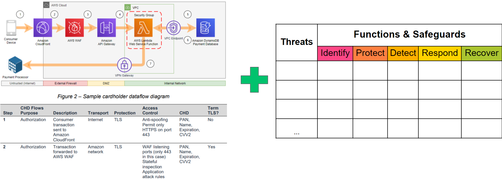

---
# Introduction
The Threat and Safeguard Matrix or (TaSM) is an action oriented view to safeguard and enable the business created by [Ross Young](https://www.linkedin.com/in/mrrossyoung/).  Simply put if Cyber is in the business of Revenue Protection, then we need to have a defense in depth plan to combat the biggest threats to our companies.  This matrix allows a company to overlay its major threats with the NIST Cyber Security Functions (Identify, Protect, Detect, Respond, & Recover) to build a security plan.  Organizations which perform this activitiy will gain a better understanding of how to protect their company as they fill in safeguards whitch mitigate important threats.  

Example: If you were to look across the information security industry, then you would notice that the largest data breaches against companies often involve Phishing, Ransomware, Web Application Attacks, and Vendor/Partner Data Loss. 

Here's one way you might build a defense in depth plan to mitigate these threats for your company.

# Using TaSM to enhance Threat Modeling
As we look for ways to apply the TaSM in an organization, one way that might be leveraged is within Threat Models.  Example: Developer teams could use a [data flow diagram](https://d1.awsstatic.com/whitepapers/compliance/pci-dss-compliance-on-aws.pdf?did=wp_card&trk=wp_card) which shows key attributes such as (Encryption Layers, Access Control Methods, and Data Types) along with the TaSM to identify key issues within their projects.  As Architecture review boards see numerous TaSMs used in threat models they might identify common threats or safeguards that need enterprise solutions.

# Using the TaSM to help standardize Risk Committees
Since cyber threats are not the only types of threats, we should look at how the TaSM could be adopted for larger use in Risk Committees.  All that is needed is an additional column to list the organization within a company.  Imagine if each organization shared their top 3-5 threats.  Your Risk Committee could show how the company is mitigating its biggest threats in a consistent, adequate, reasonable, and effective way.  Additionally it allows the committee to partner together to solve threats from multiple angles.  Example: How might Cyber leverage HR and Legal processes to help respond to Phishing attacks that cause brand damage.

# What do the terms mean?
To ensure proper use of the TaSM, be sure to understand the definitions of the terms used within the matrix

### Threats
CNSS defines a **Threat** as any event with the potential to adversely impact organizational operations.
Common Examples of Common Threat types can be found here [STRIDE-LM](assets/images/StrideLM.png "STRIDE-LM")

### NIST Functions
The 5 NIST Cyber Security Framework Functions allow you to create a defense in depth strategy which identifies how you will safeguard the business.  

**Identify**
The identify function assists in developing an organizational understanding of managing risk to systems, people, assets, data, and capabilities.  Key Objective: Identify all people, proccesses, or systems that would be vulnerable to this type of threat.  

**Protect**
The protect function supports the ability to limit or contain the impact of the threat. Key Objective: How could you limit the threat of a an attack by removing or blocking the vulnerability

**Detect**
The detect function defines the activities to identify the occurence of an event in a timely mannner.  Key Objective: If you couldn't stop the threat (ie protect phase) how would you know it's even happening and your company is experiencing harm

**Respond**
The respond function includes appropriate activities regarding an incident to minimize impact.  Key Objective: If the threat has been realized how do you prevent additional financial damage, reputation damage, non compliance, or privacy violations 

**Recover**
The recover function includes identifying appropriate activities to maintain plans for resilience and to restore services impaired during cybersuecrity incidents.  Key Objective: How do you get to a state that was equal or better than before the incident

### Safeguards
**Safeguards** are Actions, devices, procedures, techniques, or other measures that reduce the vulnerability of an information system. Synonymous with security controls and Countermeasures.  Please note you can see the [108 different safeguards outlined by NIST CSF](https://github.com/OWASP/www-project-threat-and-safeguard-matrix/blob/main/Nist_CSF_Safeguards) however feel free to use your own.
