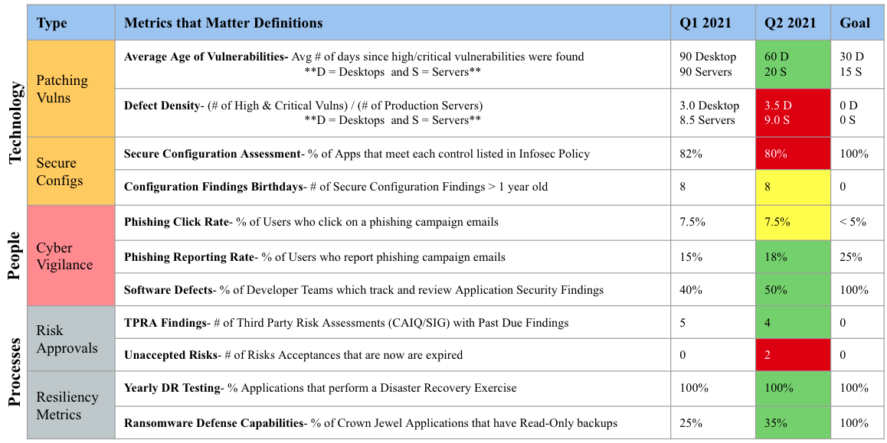

---

layout: col-sidebar
title: OWASP Threat and Safeguard Matrix (TaSM)
tags: TaSM
level: 2
type: documentation

---
 This work is licensed under a <a rel="license" href="http://creativecommons.org/licenses/by-sa/4.0/">Creative Commons Attribution-ShareAlike 4.0 International License</a>.

# Introduction
The Threat and Safeguard Matrix or (TaSM) is an action oriented view to safeguard and enable the business created by [Ross Young](https://www.linkedin.com/in/mrrossyoung/).  Simply put if Cyber is in the business of Revenue Protection, then we need to have a defense in depth plan to combat the biggest threats to our companies.  This matrix allows a company to overlay its major threats with the NIST Cyber Security Functions (Identify, Protect, Detect, Respond, & Recover) to build a security plan.  Organizations which perform this activity will gain a better understanding of how to protect their company as they fill in safeguards which mitigate important threats.  

Example: If you were to look across the information security industry, then you would notice that the largest data breaches against companies often involve Phishing, Ransomware, Web Application Attacks, and Vendor/Partner Data Loss. 

Here's one way you might build a defense in depth plan to mitigate these threats for your company.

# Adding Metrics to the Plan
Now that you have built your TaSM, it's important to look at the safeguards you listed.  Not every safeguard will be as important.  If everything is important, then nothing is truly important.  Think about the safeguards you want to focus on as an organization.  These may be the ones that are the most effective in stopping the threat.  These safeguards may also be where you have the largest opportunity to improve.  Pick a few safeguards that you can play key metrics on and highlight them by adding a red box.  This will allow you to map progress from your metrics to your TaSM.  Remember What gets measured gets done and what gets done gets funded

# Creating a Cyber Report Card
After outlining the safeguards you want to make improvements on, your organization should create some key metrics and a scorecard.  This example has a few things to notice but feel free to make modifications. 1) Group things by Technology, People, and Processes to show how you can leverage multiple areas of the organization.  2) Show progress from quarter to quarter.  If the new quarter improves mark the progress green, if it declines mark it read, and if no progress is made then mark it yellow.  3) Goals come in many shapes and sizes and should revaluated from time to time.  Goals may be aspirational such as 0 vulnerabilities.  While aspirational goals such as 100% customer happiness or 0 vulnerabilities may not be achievable, they show where the organization wants to trend.  Finally use your scorecard to tell a story that can be shared with executive leadership teams.  Please note this story is ficticious and does not reflect an actual company.

Example: This scorecard identifies the risk profile of XYZ organization.  As you can see, we show that most of our servers have roughly 9 High and Critical Vulnerabilities.  While these vulnerability numbers are higher than desired, we have observed patching is usually done within 15 days on average.  We feel comfortable in our patching program at this time.  One area we would like to highlight is only 50% of our software teams are planning on addressing software defects and vulnerabilities during upcoming sprint planning sessions.  We feel this metric could be improved next quarter to lower our overall risk posture.  We will be taking XYZ actions to help improve this metric.  Finally, we wanted to call out that not all applications are the same level of criticality; which is why we are hyper-focused on ransomware defenses.  Today we have noticed that 100% of our applications can perform Disaster Recovery exercises, but our financially significant applications listed on our SOX report do not have read-only backups. We feel this is a key area of concern and will be focused on 100% compliance by year end.  We will also be focusing on XYZ programs to ...

# Using the TaSM to enhance Threat Modeling
As we look for additional ways to apply the TaSM in an organization, one way the TaSM might be leveraged is within Threat Models.  Example: Developer teams could combine using a [data flow diagram](https://d1.awsstatic.com/whitepapers/compliance/pci-dss-compliance-on-aws.pdf?did=wp_card&trk=wp_card) which shows key attributes such as (Encryption Layers, Access Control Methods, and Data Types) with the TaSM to identify key issues within their projects.  As Architecture Review Boards see numerous TaSMs used during threat model discussions, architects might identify common threats or safeguards that need enterprise solutions.

# Using the TaSM to help improve Risk Committees
Since cyber threats are not the only types of threats, we should also look at how the TaSM could be adopted for larger use in Risk Committees.  All that is needed is an additional column to list the organization within a company.  Imagine if each organization shared their top 3-5 threats.  Your Risk Committee could show how the company is mitigating its biggest threats in a consistent, adequate, reasonable, and effective way.  Additionally, it allows the committee to partner together to solve threats from multiple angles.  Example: How might Cyber leverage HR and Legal processes to help respond to Phishing attacks that cause brand damage.

# What do the terms mean?
To ensure proper use of the TaSM, be sure to understand the definitions of the terms used within the matrix

### Threats
CNSS defines a **Threat** as any event with the potential to adversely impact organizational operations.
Examples of common threat types can be found here [STRIDE-LM](assets/images/StrideLM.png "STRIDE-LM")

### NIST Functions
The 5 NIST Cyber Security Framework Functions allow you to create a defense in depth strategy which identifies how you will safeguard the business.  

**1) Identify**
The identify function assists in developing an organizational understanding of managing risk to systems, people, assets, data, and capabilities.  Key Objective: Identify all people, processes, or systems that would be vulnerable to this type of threat.  

**2) Protect**
The protect function supports the ability to limit or contain the impact of the threat. Key Objective: How could you limit the threat of an attack by removing or blocking the vulnerability

**3) Detect**
The detect function defines the activities to identify the occurrence of an event in a timely manner.  Key Objective: If you couldn't stop the threat (i.e. protect phase) how would you know it's even happening, and your company is experiencing harm

**4) Respond**
The respond function includes appropriate activities regarding an incident to minimize impact.  Key Objective: If the threat has been realized how do you prevent additional financial damage, reputation damage, non-compliance, or privacy violations 

**5) Recover**
The recover function includes identifying appropriate activities to maintain plans for resilience and to restore services impaired during cyber security incidents.  Key Objective: How do you get to a state that was equal or better than before the incident

### Safeguards
**Safeguards** are Actions, devices, procedures, techniques, or other measures that reduce the vulnerability of an information system. Synonymous with security controls and Countermeasures.  Please note you can see the [108 different safeguards outlined by NIST CSF](https://github.com/OWASP/www-project-threat-and-safeguard-matrix/blob/main/Nist_CSF_Safeguards) however feel free to use your own.

#Thank You
Thanks to the many folks who helped inspire the Threat and Safeguard Matrix
[Cyber Defense Matrix](https://owasp.org/www-project-cyber-defense-matrix/) by [Sounil Yu](https://www.linkedin.com/in/sounil/)
[Cyber Controls Matrix](https://owasp.org/www-project-cyber-controls-matrix/) by [Eric Bragger](https://www.linkedin.com/in/eric-bragger/)
